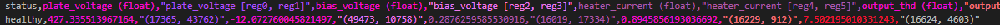

# Machine Learning on the EDGE: Real-Time Inference Model Deployment and Industrial Integration with Linux-based Systems


---

HELLO TRAVELER! Welcome to this corner of Medium. In this article we’ll deploy a Machine Learning model (Neural Network) to an EDGE device to predict the current health of a vintage audio amplifier using live data fetched from Modbus TCP registers. You’ll learn how to train the model, export it, and run real-time inferences on a Linux-based system, with results published via MQTT. It's a simple but full pipeline — from modeling on your workstation to running industrial-style inference on the EDGE.

Essentials must be known regarding Linux, Basic Networks, Python and ML Packages usage, however example code is given so you can learn going over it line by line at your pace as well.

---

## **Architecture**

First, primerisimo, before we do anything else, we need to materialize our idea. There may be a general direction that came semi-clear after an extensive and exhausting 5-minute brainstorming session with ourselves, however previous to advancing it's recommendable, and I´d say an essential, step, to **define an architecture** for our project.

Whether it's for personal goals, academic practice, or a real business-case project, having a roadmap on where we are heading, as well as the why and the how, will be incredibly helpful.

Let's elaborate a bit --->

### Hardware Stack

***What hardware is available ?** Software offers a bit more flexiblity, there are usually various options to do a same thing, but that perk is most of the time dictated by what hardware we can use for our project. Maybe we don't have lots of options at home, just some board lying around, or on a professional enviroment the customer's project budget might define what kind of devices can be acquired for a determined solution.

For this project, we'll be using a **KUNBUS RevPi Connect S** module.

<p align="center">
  
</p>

**"Why ? What even is that?"** Well, this is a pretty versatile piece of technology that'll allow this exact same practice to be replicated on many other devices/systems as well; it's basically a **Raspberry Pi 3 Compute module** installed in a custom circuit board that provides a bit more interfaces for industrial-level applications (2x Independent Ethernet Ports, Serial, etc.), but these same adaptations can be done to a common Raspberry Pi 3B.

For example, by connecting an USB-to-Ethernet adapter on one of the USB ports would give us the capability of using said Raspberry Pi 3B as an initial playfield for industrial gateway functions testing (emphasis on TESTING, don't deploy that setup on a field installation, **please**).

Therefore, our required hardware would be:

    - Laptop/Workstation (Windows OS for these tests, but you can do it on any Linux distro using equivalent software if you desire and know how to)
    - KUNBUS RevPi Connect S (or a Raspberry Pi 3, maybe even a 2)
    - Ethernet Cable

### Software Stack

Ok, having defined a pretty friendly and accesible hardware setup, let's talk software.

Raspberry Pi modules use **Raspbian** as their **Operative System (OS)**, which is in reality just a **flavor of Debian**, which is a **Linux distribution** (meaning it uses the Linux kernel).

<p align="center">
  
</p>

Some Linux distributions really go hard on niche adequations, but luckily Debian AND Raspbian are a couple of the most popular and accesible out there. There are lots of differences, but consider even the famous Ubuntu OS is based on Debian.

This means we can easily find lots of **software available from the worldwide community** to accomplish our goal (or use it as a tool to build or own).

In this case, we'll be using:

    - Python 3.9+, as our programming language

        - pyModbusTCP, to enable communication via the ModbusTCP industrial protocol
        - paho-mqtt, to enable communication via the MQTT pub/sub protocol (very popular in IoT applications)
        - tensorflow & scikit-learn, to develop, train and export/import/use our inference model
        - joblib, helps us import the exported model
        - numpy, helps us manage numeric data structures for our model, very powerful and essential library on ML
        - pandas, for data management and processing, also incredibly useful for Data Science and ML.
        - matplotlib, for visualization: figures and plots generation

    - Mosquitto Broker, a reliable MQTT broker to publish our model results to

    - QModMaster, a ModbusTCP master simulator to test our master/slave comms

<p align="center">
  
</p>

#### Pre-Requisite Configurations and Installations

Before going further, it is better to have everything prepared. You can also re-visit this section later, but doing this with antelation will help on progressing smoothly along with me in this article. Holding hands and all. * *Blushes slightly* *.

**On the Laptop/Workstation:**

1. Make sure **Python** is installed on your system, if it is not, download it from here and follow the recommended and official installation instructions: https://www.python.org/downloads/release/python-3100/
2. Start up a shell on Documents or navigate to it:
```
cd Documents
```
3. Create a directory for this project and navigate to it
```
mkdir ml_edge_project
cd ml_edge_project
```
4. Create a **Python Virtual Enviroment**
```
python -m venv .venv
```
5. Activate the **Virtual Environment**
```
source activate venv
```
6. Download & install the required **Python libraries/packages**
```
pip install paho-mqtt pandas numpy scikit-learn tensorflow matplotlib
```
7. Download & unzip the **QModMaster** desktop app (https://sourceforge.net/projects/qmodmaster/).
<p align="center">
  
</p>

7. Configure your machine's **Ethernet Port** with a **Static IPv4 Address**. Use `192.168.1.200` for this example.
<p align="center">
  
</p>

**On the RevPi Connect S / Raspberry Pi:**

1. Make sure Python is installed on your system, if it is not, download it from here and follow the recommended and official installation instructions: https://www.python.org/downloads/release/python-3100/
2. Start up a shell on Documents
```
cd Documents
```
3. Create a directory for this project and navigate to it
```
mkdir ml_edge_project
cd ml_edge_project
```
4. Create a Python Virtual Enviroment
```
python -m venv .venv
```
5. Activate the Virtual Environment
```
source activate venv
```
6. Download & install the required Python libraries/packages
```
pip install pyModbusTCP paho-mqtt tensorflow joblib numpy
```
7. Download, install and enable the Mosquitto MQTT Broker
```
sudo apt update && sudo apt upgrade
sudo apt install -y mosquitto mosquitto-clients
sudo systemctl enable mosquitto.service
```

8. Validate mosquitto installation (print version)
```
mosquitto -v
```

9. Configure access (allow all basically, just for tests)
```
sudo nano /etc/mosquitto/mosquitto.conf
```

Insert these lines at the end:

```
listener 1883
allow_anonymous true
```
Save and exit.

10. Configure your EDGE device's **Ethernet Port** with a **Static IPv4 Address**. Use `192.168.1.75` for this example.
<p align="center">
  
</p>

### Diagram

We got the hardware and software lists, now let's make it visual for easy follow-up.

This diagram contains all that we just specified but in a more ineresting, clear and efficient manner.


## **Communication**

### Data Mapping

Any project needs a data map. It can be as simple as a napkin with "inputs & outputs" annotated on it, or a more professional and aestethic table/document with various columns covering specifics such as names, tags, data types, protocols, registers, sources, destinations, descriptions, etc.

Let's use this one for our practice:

##### Model Inputs and Outputs

| Feature Name     | Description                          | Unit      | Source                |
|------------------|--------------------------------------|-----------|------------------------|
| `plate_voltage`  | Voltage at amplifier tube plates     | Volts (V) | ModbusTCP Holding Register (40001–40002) |
| `bias_voltage`   | Biasing voltage for the tube grid    | Volts (V) | ModbusTCP Holding Register (40003–40004) |
| `heater_current` | Current through the heater element   | Amps (A)  | ModbusTCP Holding Register (40005–40006) |
| `output_thd`     | Total harmonic distortion at output  | Percent (%) | ModbusTCP Holding Register (40007–40008) |
| `impedance`      | Load impedance seen by the amplifier | Ohms (Ω)  | ModbusTCP Holding Register (40009–40010) |

##### Model Output

| Output Label   | Meaning                                  |
|----------------|-------------------------------------------|
| `healthy`      | Amp is functioning normally              |
| `unstable`     | Some irregularities, may require checking |
| `overdriven`   | Amp is being pushed beyond safe levels   |
| `failsoon`     | Amp is showing signs of imminent failure |

### Modbus TCP

We know the input data for our inference service will come from a ModbusTCP Master (simulated by QModMaster), that will write to our virtual ModbusTCP Slave device's registers. We will then ciclically read the data contained on those registers, convert it from two separate 16-bit registers, into a single 32-bit floating point value that can be more easily be taken by our model.

On the Pre-Requisites step we already prepared our environment, so let's start working.

On our working directory, create a file called `ml_edge_service.py` and insert this code with your preferred coding IDE or text editor:

```
from pyModbusTCP.client import ModbusClient
import struct
import time

# Modbus Client
modbus_client = ModbusClient(host="192.168.1.75", port=502, auto_open=True)

# Function to read 32-bit float from 2 Modbus registers
def read_float(start_address):
    regs = modbus_client.read_holding_registers(start_address, 2)
    if regs:
        return struct.unpack('>f', struct.pack('>HH', regs[0], regs[1]))[0]
    return None
```

### MQTT

To make our model's inference results available, we can publish them to any MQTT topic we want (as long as we follow topic naming and syntax rules), but first we need our Mosquitto MQTT Broker running.

To do that we

Now we modify our `ml_edge_service.py`, adding MQTT publishing functions so that it looks like this:

```
import paho.mqtt.client as mqtt

# MQTT Client
mqtt_client = mqtt.Client()
mqtt_client.connect("localhost", 1883, 60)
```

Our `ml_edge_service.py` file is partially ready, it still needs it's core, the inference model. Let's save the script for now and proceed to work con that.

## **Modeling**

### Data

First we get our practice project data `data.csv` and put it on the same directory as the `ml_edge_service.py` script. This data is already clean, but be conscious real world problems, are indeed problems and part of it is the whole data engineering process. Data almost never will come clean from the source.

Download the Vintage Amplifier Health Dataset [>>> HERE <<<](https://drive.google.com/drive/folders/1wO_uaqUrUKWfm77W35Jeu5Qe64ujZRlE?usp=sharing)

For the modeling stage, we will be using the `data.csv` file.

Let's create a new script called `model.py` in our working directory, and start writing our first lines on it. Add the following:

```
import pandas as pd
import numpy as np
from sklearn.model_selection import train_test_split
from sklearn.preprocessing import LabelEncoder, StandardScaler
import joblib

# Load and encode dataset
df = pd.read_csv("data.csv")
le = LabelEncoder()
df['status_encoded'] = le.fit_transform(df['status'])

# Features and labels
X = df.drop(['status', 'status_encoded'], axis=1).values
y = df['status_encoded'].values

# Normalize
scaler = StandardScaler()
X_scaled = scaler.fit_transform(X)
joblib.dump(scaler, "scaler.save")

# Split
X_train, X_temp, y_train, y_temp = train_test_split(X_scaled, y, test_size=0.3, random_state=42)
X_val, X_test, y_val, y_test = train_test_split(X_temp, y_temp, test_size=0.5, random_state=42)

```

### Building

Now, time to define our model's structure. Since we are dealing with non-linear relationships and numerical inputs in this practice project, we'll be using a simple Neural Network (Sequential Dense Layer). These are often good enough for receiving continuous sensor inputs and outputting discrete states while maintaining complexity low.

<p align="center">
  
</p>

Take this code chunk and insert it on the `model.py` script:

```
# MODEL BUILDING STAGE
# ---------------------
import tensorflow as tf

model = tf.keras.Sequential([
    tf.keras.layers.Dense(64, activation='relu', input_shape=(5,)),
    tf.keras.layers.Dense(32, activation='relu'),
    tf.keras.layers.Dense(16, activation='relu'),
    tf.keras.layers.Dense(4, activation='softmax')
])

model.compile(optimizer='adam', loss='sparse_categorical_crossentropy', metrics=['accuracy'])
```

This model architecture should do just fine for test purposes. Let's go ahead and add our training logic.

### Training

To train our model, lets add this chunk of code:

```
# TRAINING STAGE
# --------------
history = model.fit(X_train, y_train, epochs=50, validation_data=(X_val, y_val))

```

Here we will be training our model for 50 epochs (data is syntethic and light so it will learn quickly), and storing the metrics history then plot/analyze them and assess our model's training/validation performance.

### Tests

After training, we want to test our model on unseen data (besides the validation one), so lets add some more code here and there:

```
# TESTING STAGE
# -------------

import matplotlib.pyplot as plt

# Evaluate the model on test data
loss, acc = model.evaluate(X_test, y_test)
print(f"Test Accuracy: {acc:.2f}")

# Plot training history
plt.figure(figsize=(12, 5))

# Accuracy plot
plt.subplot(1, 2, 1)
plt.plot(history.history['accuracy'], label='Train Acc')
plt.plot(history.history['val_accuracy'], label='Val Acc')
plt.title('Model Accuracy')
plt.xlabel('Epoch')
plt.ylabel('Accuracy')
plt.legend()
plt.grid(True)

# Loss plot
plt.subplot(1, 2, 2)
plt.plot(history.history['loss'], label='Train Loss')
plt.plot(history.history['val_loss'], label='Val Loss')
plt.title('Model Loss')
plt.xlabel('Epoch')
plt.ylabel('Loss')
plt.legend()
plt.grid(True)

# Save and show the plot
plt.tight_layout()
plt.savefig("training_history.png")
plt.show()
```

### Exportation

Now let's add a couple more lines to export our model once testing is done, so that it becomes available for us to use on our target device (RevPi/RasPi).

```
# EXPORTATION STAGE
# ------------------
model.save("amp_model.h5")
```

### Completed `model.py` Script

```
import pandas as pd
import numpy as np
from sklearn.model_selection import train_test_split
from sklearn.preprocessing import LabelEncoder, StandardScaler
import tensorflow as tf
import joblib
import matplotlib.pyplot as plt

# Load data
df = pd.read_csv("data.csv")

# Encode target
le = LabelEncoder()
df['status_encoded'] = le.fit_transform(df['status'])

# Features and labels
X = df.drop(['status', 'status_encoded'], axis=1).values
y = df['status_encoded'].values

# Normalize features
scaler = StandardScaler()
X_scaled = scaler.fit_transform(X)
joblib.dump(scaler, "scaler.save")

# Split dataset
X_train, X_temp, y_train, y_temp = train_test_split(X_scaled, y, test_size=0.3, random_state=42)
X_val, X_test, y_val, y_test = train_test_split(X_temp, y_temp, test_size=0.5, random_state=42)

# Build model
model = tf.keras.Sequential([
    tf.keras.layers.Dense(64, activation='relu', input_shape=(5,)),
    tf.keras.layers.Dense(32, activation='relu'),
    tf.keras.layers.Dense(16, activation='relu'),
    tf.keras.layers.Dense(4, activation='softmax')
])

model.compile(optimizer='adam', loss='sparse_categorical_crossentropy', metrics=['accuracy'])

# Train model
history = model.fit(X_train, y_train, epochs=50, validation_data=(X_val, y_val))

# Evaluate model
loss, acc = model.evaluate(X_test, y_test)
print(f"Test Accuracy: {acc:.2f}")

# Plot training history
plt.figure(figsize=(12, 5))

# Accuracy plot
plt.subplot(1, 2, 1)
plt.plot(history.history['accuracy'], label='Train Acc')
plt.plot(history.history['val_accuracy'], label='Val Acc')
plt.title('Model Accuracy')
plt.xlabel('Epoch')
plt.ylabel('Accuracy')
plt.legend()
plt.grid(True)

# Loss plot
plt.subplot(1, 2, 2)
plt.plot(history.history['loss'], label='Train Loss')
plt.plot(history.history['val_loss'], label='Val Loss')
plt.title('Model Loss')
plt.xlabel('Epoch')
plt.ylabel('Loss')
plt.legend()
plt.grid(True)

# Save and show the plot
plt.tight_layout()
plt.savefig("training_history.png")
plt.show()

# Export model
model.save("amp_model.h5")
```

Great. Our code is ready to run ! The full pipeline should import and prepare our dataset, build the model, train it (while running validations), test it, give us some metrics, and save the model as a file.


Above you can see what I obtained from this pipeline, and it's good enough to test it online (deploying it to run as a service), this was obvious though as our dataset is syntethic .

## **Deployment**


### Calling Exported Model from Python Script

Ok, so let's go back to our `ml_edge_service.py` script, and add a few missing lines.

Said lines would be the ones in charge of loading our previously exported model, and making it readily available to receive data and output some inferences, continously as a service of course.

Add the following:

```
import tensorflow as tf
import numpy as np
import joblib

# Load model and scaler
model = tf.keras.models.load_model("amp_model.h5")
scaler = joblib.load("scaler.save")
labels = ["healthy", "unstable", "overdriven", "failsoon"]

while True:
    plate_voltage = read_float(0)
    bias_voltage = read_float(2)
    heater_current = read_float(4)
    output_thd = read_float(6)
    impedance = read_float(8)

    if None not in (plate_voltage, bias_voltage, heater_current, output_thd, impedance):
        X = np.array([[plate_voltage, bias_voltage, heater_current, output_thd, impedance]])
        X_scaled = scaler.transform(X)
        prediction = model.predict(X_scaled)
        label = labels[np.argmax(prediction)]
        mqtt_client.publish("amp/inference", label)

    time.sleep(1)
```

### Completed `ml_edge_service.py` Script

This is how the final `ml_edge_service.py` script would look like:

```
from pyModbusTCP.client import ModbusClient
import time
import struct
import tensorflow as tf
import numpy as np
import joblib
import paho.mqtt.client as mqtt

# Modbus Client
modbus_client = ModbusClient(host="192.168.1.75", port=502, auto_open=True)

# MQTT Client
mqtt_client = mqtt.Client()
mqtt_client.connect("localhost", 1883, 60)

# Load model and scaler
model = tf.keras.models.load_model("amp_model.h5")
scaler = joblib.load("scaler.save")

# Function to read 32-bit float from 2 Modbus registers
def read_float(start_address):
    regs = modbus_client.read_holding_registers(start_address, 2)
    if regs:
        return struct.unpack('>f', struct.pack('>HH', regs[0], regs[1]))[0]
    return None

labels = ["healthy", "unstable", "overdriven", "failsoon"]

while True:
    plate_voltage = read_float(0)
    bias_voltage = read_float(2)
    heater_current = read_float(4)
    output_thd = read_float(6)
    impedance = read_float(8)

    if None not in (plate_voltage, bias_voltage, heater_current, output_thd, impedance):
        X = np.array([[plate_voltage, bias_voltage, heater_current, output_thd, impedance]])
        X_scaled = scaler.transform(X)
        prediction = model.predict(X_scaled)
        label = labels[np.argmax(prediction)]
        mqtt_client.publish("amp/inference", label)

    time.sleep(1)
```

### Set up Python Script execution as a System Service

Our `ml_edge_service.py` script is now complete, it's inevitable, now let's configure it to run as a system service.

To achieve that let's create a service file called `ml_edge_service.service` on the systemd directory directly (you may need `sudo` right for this):

```
sudo nano /etc/systemd/system/ml_edge_service.service
```

Paste this code inside it:

```
[Unit]
Description= ML Amplifier Health Inference Model Service
After=network.target

[Service]
ExecStart=/usr/bin/python3 /home/pi/Documents/ml_edge_project/ml_edge_service.py
WorkingDirectory=/home/pi/Documents/ml_edge_project/
Restart=always
User=pi

[Install]
WantedBy=multi-user.target
```

Save and exit, and now it resides where the rest of the services inhabit. You can now use the following commands in our open system shell to fire it up:

```
sudo systemctl daemon-reexec
sudo systemctl daemon-reload
sudo systemctl enable ml_edge_service
sudo systemctl start ml_edge_service
```

You can monitor the service with this command:

```
sudo systemctl status ml_edge_service
```

And can also stop and restart it with this ones:

```
sudo systemctl stop ml_edge_service
sudo systemctl restart ml_edge_service
```

### Use QModMaster to Feed and Test the Inference Model Service

Now that we have the service up and running on the EDGE device (RevPi/RasPi), awaiting for some data to ingest, lets start up a QModMaster instance and set it up to write values to our ModbusTCP Slave (on EDGE device).

First Configure the target Slave IP and make sure to have the correct settings, as shown below.


Then proceed to connect, and enable cyclic updates. After that start writing values, use the ones in the image as a first example or any of the examples given in the `test_samples.csv` file provided earlier alng with the `data.csv` file.

<p align="center">
  
</p>

I'm using the sample line shown below. We- are exepcting to receive healthy as the model's inference for said input data.

<p align="center">
  
</p>

The service should automatically read and process the data in the ModbusTCP Slave's registers, feed it to the model and output some results ready for us to see. Let's find out how to view them.

## **Monitoring**

### CLI App Reading and Printing Results

As we know, now our model results are being published to the topic `amp/inference`, and it's available at the address of the Mosquitto MQTT Broker running in our EDGE device (RevPi/RasPi). So, let's read them from our Laptop/Workstation as if we were a client trying to fetch and make use of those results.

Create a script called `ml_edge_monitoring.py` on your laptop/workstation working directory, and insert the following code:

```
import paho.mqtt.client as mqtt

def on_message(client, userdata, msg):
    print(f"[INFERENCE] {msg.payload.decode()}")

mqtt_client = mqtt.Client()
mqtt_client.connect("192.168.1.75", 1883, 60)
mqtt_client.subscribe("amp/inference")
mqtt_client.on_message = on_message
mqtt_client.loop_forever()
```

Now run the script, and you should see the model results being output periodically, practically in real-time as they come out (don't take the real-time part too seriously).

<p align="center">
  
</p>

... and there you go, a fully functional **inference ML model running as a service on an EDGE Linux-based device**, at your disposal! Don't try to sell it yet though. There is still lots to do ...

Congrats however! I'm proud of you for reaching this point, champ.

---

## **Areas of Opportunity**

There are so many other thing's I wish I could've included here. Topics for the future maybe, but here are some of them so you can explore them on your own and make a killer ML Edge service.

#### OPC UA


Integrate **OPC UA Client** functions for even more industrial communication protocol compatibility. This is a very popular and **industry standard protocol** widely used in **OT Networks** for large enterprises around the globe.

Get some leverage on this with the Python `ocpua` library.

#### Docker


Having trouble getting things to work on different devices or systems ? Fear no more, **Docker containers** can help you with that !

They can also provide ways for more efficient **CI/CD pipelines** that would benefit your model deployments.

Maybe even use **Kubernetes** to **orchestrate** those containers and make everything stable while scalable.

#### FastAPI


A smart way to make data available to many different apps would be serving an **HTTP Server** that responds to requests on your models results or metrics. Great for monitoring and for result visualization **(dashboards?)**.

#### Dashboard


Make some dashboards with tools like **Plotly** or **Grafana**, there are lots of tools. Everyone appreciates an aestethic looking UI with just the correct amount of information and detail.

#### Database


Maybe add somewhere to store your model's results and performance metrics ? A database would be an ideal !

**SQLite** is great for small deployments, or you can get **PostgreSQL** for a bigger, more robust platform to construct over.

#### Logging


Tired of needing to be attentive to the CLI stream of results and metrics, just **log** them instead and see them later ! Or even catch runtime errors for future debugging.

Basic **logfiles** getting too big, or saturating too fast? Use **rotating logfiles** ! These allow you to have overwriteable logfiles (and even generate a custom quantity of backups once the size limit is reached) that cycle over themselves, don't fill up more space over time, and that never stop.

Great for setting and forgetting, on some cases.

## **Recommendations**

### Getting to know your data’s nature, properties, and quality from the start

This project was just a quick and fun proposal for testing various technologies that could be used in industrial environment if implementend in a proper and robust manner. However, to achieve said robustness, one of the most important steps is to **make sure you know your data**. Dedicate some time to exploring it, take a look at historics, learn it's nuisances.

For example:

 - Why am I observing gaps on my data ?
 - Why are there such grotesque peaks every now and then ?
 - Why are strings being received in a supposedly numeric input ?
 - Lots of similar (or worse (or funnier)) examples

Sounds laughable, but it happens more often than you'd think. Even on pro settings.

### Do testing and make robust pipelines (before data reaches your model)

Taking in account that last recommendation, will help you be conscious of your project-specific problems and, consequentially, impulse you to attempt (and succeed, yay) developing **error-proof pipelines** from the beginning, because remember, even if the model is running and outputting something, it doesn't mean it's right.

As ancient hawaiians used to say:  ***"GIGO: Garbage In, Garbage Out"***.

<p align="center">
  
</p>

---

Hope you liked this tiny bit of knowledge that I very carefully curated for you. I did like sharing it with you.

You can contact me on any of the following places:

 * [LinkedIn]()
 * Email: lfmartinezmendoza@gmail.com
